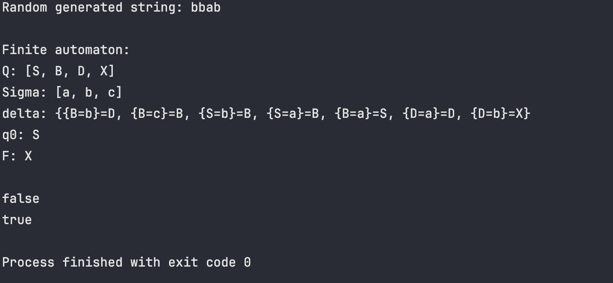
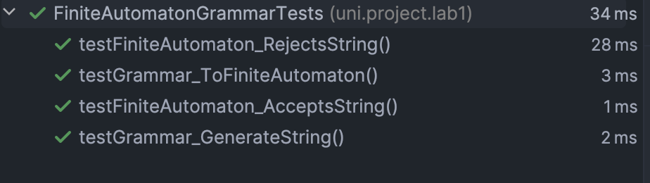

# Lab Report: Intro to Formal Languages and Finite Automata

### Course: Formal Languages & Finite Automata
### Author: Maxim Costov

---

## Overview
This lab focuses on understanding formal languages, regular grammars, and finite automata. We explore the components of formal languages, implement a grammar, generate valid strings, convert the grammar to a finite automaton, and verify if strings belong to the language.

---

## Objectives

1. **Understanding Formal Languages**:  
   A formal language consists of:
    - **Alphabet (VT)**: Set of valid characters.
    - **Vocabulary**: Set of valid words.
    - **Grammar (P)**: Set of rules/constraints.

2. **Project Setup**:
    - Created a GitHub repository to store and manage the project.
    - Chose Java for implementation due to its robustness and familiarity.
    - Reports are stored separately for easy verification.

3. **Grammar Implementation**:
    - **Variant 11 Grammar Definition**:
        - Non-terminal symbols (VN): \( \{S, B, D\} \)
        - Terminal symbols (VT): \( \{a, b, c\} \)
        - Production rules (P):
            - S → aB
            - S → bB
            - B → bD
            - D → b
            - D → aD
            - B → cB
            - B → aS

    - **Tasks Completed**:
        - Implemented a `Grammar` class to define and manage the grammar.
        - Added a function to generate 5 valid strings.
        - Converted the grammar to a finite automaton.
        - Implemented a method in the finite automaton to check string validity.

---

## Implementation

### 1. Grammar Class
Implemented a class `Grammar` with methods to generate valid strings and convert the grammar to a finite automaton.
#### Here is my `generateString` method:
```java
public String generateString() {
    StringBuilder sb = new StringBuilder(startVariable);
    int cursor = 0;
    while (cursor < sb.length()) {
        char c = sb.charAt(cursor);
        if (Character.isLowerCase(c)) {
            cursor++;
        } else {
            List<String> possibleValues = hashMap.get(String.valueOf(c));
            if (possibleValues == null || possibleValues.isEmpty()) {
                throw new IllegalStateException("No production rule for non-terminal: " + c);
            }
            String replacement = possibleValues.get((int) (Math.random() * possibleValues.size()));
            sb.replace(cursor, cursor + 1, replacement);}
    }
    return sb.toString();
}
```

#### With this method I convert a regular grammar class into finite automaton class:
```java
public FiniteAutomaton toFiniteAutomaton() {
    List<String> sigma = new ArrayList<>(VT);
    List<String> Q = new ArrayList<>(VN);
    Q.add("X");
    String q0 = startVariable;
    String finalState = "X";
    HashMap<HashMap<String, String>, String> delta  = new HashMap<>();
    Set<String> keySet = hashMap.keySet();
    for (String key : keySet) {
        List<String> values = hashMap.get(key);
        for (String value : values) {
            if (value.length() == 2) {
                HashMap<String, String> transitionKey = new HashMap<>();
                transitionKey.put(key, String.valueOf(value.charAt(0)));

                delta.put(transitionKey, String.valueOf(value.charAt(1)));
            } else if (value.length() == 1) {
                HashMap<String, String> transitionKey = new HashMap<>();
                transitionKey.put(key, value);

                delta.put(transitionKey, finalState);
            }
        }
    }
    return new FiniteAutomaton(Q, sigma, delta, q0, finalState);
}
```

### 2. Finite Automaton Class
#### In this class the only method is `stringBelongToLanguag` where we can check if the string can represent a finite automaton according to our rules:

```java
public boolean stringBelongToLanguage(final String inputString) {
    String currentState = q0;
    Character cursor;
    for (int i = 0; i < inputString.length(); i++) {
        cursor = inputString.charAt(i);
        HashMap<String, String> key = new HashMap<>();
        key.put(currentState, String.valueOf(cursor));
        String value = delta.get(key);
        if (value == null) return false;
        currentState = value;
    }
    return true;
}
```

### 3. Main Class
Demonstrated the functionality by generating strings and verifying them.

```java
public static void main(String[] args) {
    List<String> VN = Arrays.asList(new String[]{"S", "B", "D"});

    List<String> VT = Arrays.asList(new String[]{"a", "b", "c"});

    String startVariable = "S";

    HashMap<String, List<String>> hashMap = new HashMap<>();
    hashMap.put("S", Arrays.asList("aB", "bB"));
    hashMap.put("B", Arrays.asList("bD", "cB", "aS"));
    hashMap.put("D", Arrays.asList("b", "aD"));


    Grammar grammar = new Grammar(VN, VT, startVariable, hashMap);
    System.out.println(grammar.generteString());
    FiniteAutomaton fa = grammar.toFiniteAutomaton();
    System.out.println(fa);
    System.out.println(fa.stringBelongToLanguage("asfdsfsdf"));
    System.out.println(fa.stringBelongToLanguage(grammar.generteString()));
}
```

### Output:


### Unittests:
#### I also created some unit tests to check if my program works properly. You can check the code in `test` folder.
### Test results:

---

## Results

1. **Generated Strings:**
    - Example output of 5 valid strings generated by the grammar:
        - `abb`
        - `acbab`
        - `bcbabb`
        - `ababb`
        - `bacbabb`

2. **Finite Automaton Validation:**
    - Tested string `abb` belongs to the language: **True**
    - Tested string `abc`: **False** (not following valid transitions)

---

## Conclusion
In this lab, I successfully:
- Understood the structure and components of formal languages.
- Implemented a grammar based on the provided variant.
- Generated valid strings and converted the grammar to a finite automaton.
- Verified string membership in the language using the finite automaton.

This lab provided practical experience with formal grammars and finite automata, reinforcing theoretical concepts with hands-on coding tasks.

---

## Repository Link
[GitHub Repository](https://github.com/MaxKostov/DSL_Labs)

---

## References
1. Java Documentation: [https://docs.oracle.com/javase/](https://docs.oracle.com/javase/)

---

