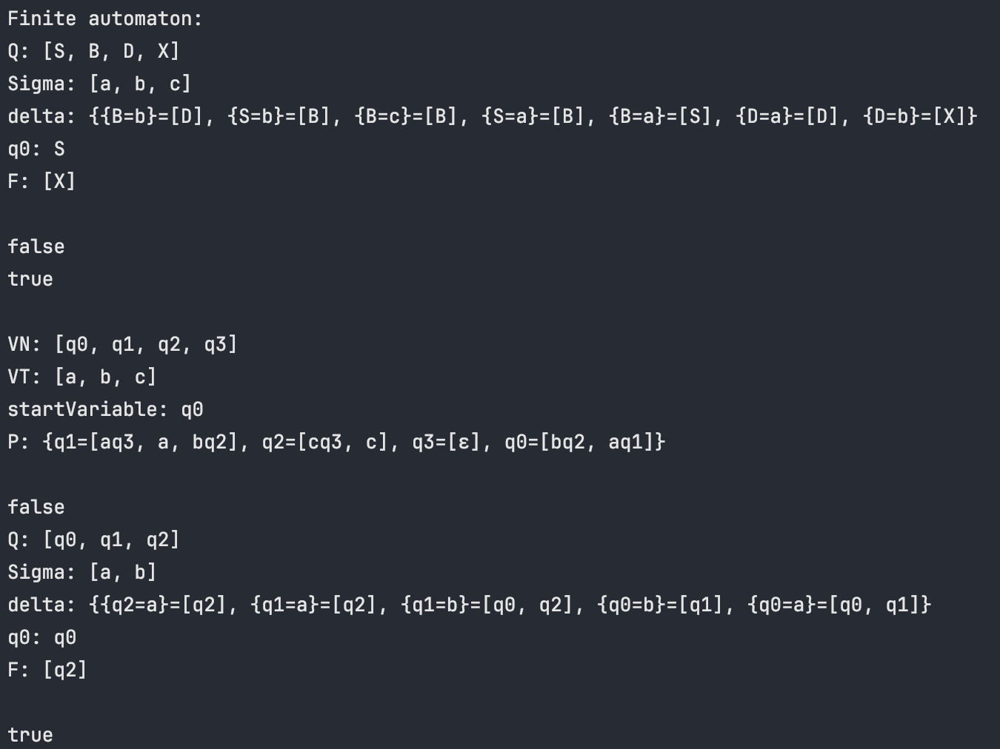
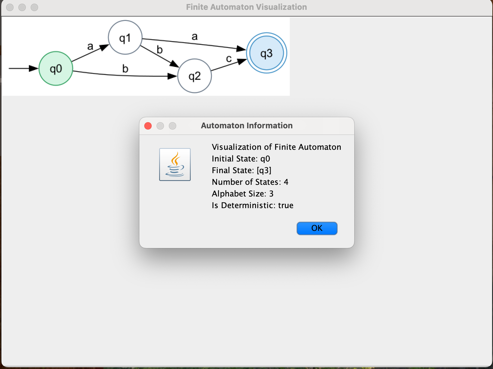
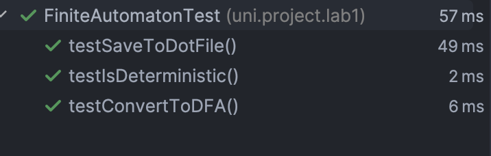
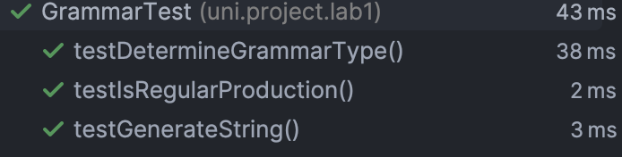

# Lab Report: Determinism in Finite Automata. Conversion from NDFA 2 DFA. Chomsky Hierarchy.

### Course: Formal Languages & Finite Automata
### Author: Maxim Costov

---

## Overview
A finite automaton is a mechanism used to represent processes of different kinds. It can be compared to a state machine as they both have similar structures and purpose as well. The word finite signifies the fact that an automaton comes with a starting and a set of final states. In other words, for process modeled by an automaton has a beginning and an ending.

Based on the structure of an automaton, there are cases in which with one transition multiple states can be reached which causes non determinism to appear. In general, when talking about systems theory the word determinism characterizes how predictable a system is. If there are random variables involved, the system becomes stochastic or non deterministic.

That being said, the automata can be classified as non-/deterministic, and there is in fact a possibility to reach determinism by following algorithms which modify the structure of the automaton.

---

## Objectives

Understand what an automaton is and what it can be used for.

Continuing the work in the same repository and the same project, the following need to be added: a. Provide a function in your grammar type/class that could classify the grammar based on Chomsky hierarchy.

b. For this you can use the variant from the previous lab.

According to your variant number (by universal convention it is register ID), get the finite automaton definition and do the following tasks:

a. Implement conversion of a finite automaton to a regular grammar.

b. Determine whether your FA is deterministic or non-deterministic.

c. Implement some functionality that would convert an NDFA to a DFA.

d. Represent the finite automaton graphically (Optional, and can be considered as a bonus point):

You can use external libraries, tools or APIs to generate the figures/diagrams.

Your program needs to gather and send the data about the automaton and the lib/tool/API return the visual representation.

Please consider that all elements of the task 3 can be done manually, writing a detailed report about how you've done the conversion and what changes have you introduced. In case if you'll be able to write a complete program that will take some finite automata and then convert it to the regular grammar - this will be a good bonus point.

### Variant 11:
- Q = {q0,q1,q2,q3},
- ∑ = {a,b,c},
- F = {q3},
- δ(q0,a) = q1,
- δ(q1,b) = q2,
- δ(q2,c) = q0,
- δ(q1,a) = q3,
- δ(q0,b) = q2,
- δ(q2,c) = q3.

---

## Theoretical Background on Finite Automaton

A finite automaton is a mathematical model of computation used to represent and recognize regular languages. It consists of a finite set of states, a finite set of input symbols (alphabet), transitions between states based on input symbols, an initial state, and a set of accepting (final) states.

There are two main types of finite automata:

1. **Deterministic Finite Automaton (DFA)**: For each state and input symbol, there is exactly one transition to a next state.
2. **Non-deterministic Finite Automaton (NFA)**: For a given state and input symbol, there can be multiple possible next states.

Key components of a finite automaton:

- **Q**: Finite set of states.
- **Σ**: Finite set of input symbols (alphabet).
- **δ**: Transition function \( \delta: Q \times \Sigma \rightarrow Q \), describing state transitions based on input symbols.
- **q0**: Initial state (\( q_0 \in Q \)).
- **F**: Set of accepting (final) states (\( F \subseteq Q \)).

A string is accepted by a finite automaton if there is a sequence of transitions from the initial state to an accepting state after processing all input symbols.

Finite automata are fundamental in the study of formal languages, as they correspond precisely to regular languages. Regular grammars can be transformed into finite automata and vice versa, which is a key concept in the theory of computation.

---

## Implementation

### 1. Grammar Class
In this lab I've edited the grammar class, so  I think this line of code is one of the most important changes:
```java
private final HashMap<String, List<String>> hashMap;
```
As you can see, now I use `List<String>` instead of simple `String` for value of my Hash map.
It is because now I should work no only with dfa, but also with nfa.

Also, I've edited toFiniteAutomaton() method, so now I can generate as dfa as nfa as well.
It is because I edited hashmap for delta:
```java
HashMap<HashMap<String, String>, List<String>> delta = new HashMap<>();
```

The given code converts a context-free grammar represented by a `hashMap` into a finite automaton stored in `delta`. Let’s break it down step by step.

### Outer Loop: Iterating Over Grammar Rules

```java
for (Map.Entry<String, List<String>> entry : hashMap.entrySet()) {
    String nonTerminal = entry.getKey();
    List<String> productions = entry.getValue();
```

- **`hashMap`**: Contains grammar rules where:
    - **Key** (`nonTerminal`): A non-terminal symbol (VN).
    - **Value** (`productions`): A list of production rules (right-hand sides).
- The loop iterates through each non-terminal and its associated production rules.

### Inner Loop: Processing Productions

#### Case 1: ε-production (empty string)

```java
    for (String production : productions) {
        if (production.equals("ε")) {
            HashMap<String, String> key = new HashMap<>();
            key.put(nonTerminal, "ε");
            delta.computeIfAbsent(key, k -> new ArrayList<>()).add("X");
            continue;
        }
```

- If a production is the empty string **ε**:
    - A key is created: `{ nonTerminal -> ε }`
    - The `delta` map associates this key with a value list containing "X" (possibly representing a special state or action for ε-transitions).
    - **`computeIfAbsent`**: Ensures the key exists in `delta`, initializing an empty list if absent.

#### Case 2: Single terminal production (A -> a)

```java
        if (production.length() == 1 && VT.contains(production)) {
            HashMap<String, String> key = new HashMap<>();
            key.put(nonTerminal, production);
            delta.computeIfAbsent(key, k -> new ArrayList<>()).add("X");
        }
```

- If the production contains exactly one symbol **a** and it's a **terminal** (in `VT`):
    - A key is created: `{ nonTerminal -> terminal }`
    - The key is added to `delta` with "X" as the value.

#### Case 3: Non-terminal followed by terminal (A -> aB)

```java
        else if (production.length() == 2) {
            char terminal = production.charAt(0);
            char nextState = production.charAt(1);
            String terminalStr = String.valueOf(terminal);
            String nextStateStr = String.valueOf(nextState);

            if (VT.contains(terminalStr) && VN.contains(nextStateStr)) {
                HashMap<String, String> key = new HashMap<>();
                key.put(nonTerminal, terminalStr);
                delta.computeIfAbsent(key, k -> new ArrayList<>()).add(nextStateStr);
            }
        }
```

- If the production is of length 2 (like **aB**):
    - The first character **a** is checked to be a terminal (in `VT`).
    - The second character **B** is checked to be a non-terminal (in `VN`).
    - A key is created: `{ nonTerminal -> a }`
    - The value associated with the key in `delta` is the next state **B**.

I also appended checking to which type my grammar is.
```java
        for (Map.Entry<String, List<String>> entry : hashMap.entrySet()) {
            String leftSide = entry.getKey();
            List<String> rightSides = entry.getValue();

            if (!VN.contains(leftSide) || leftSide.length() != 1) {
                isRegular = false;
                isContextFree = false;
            }

            for (String rightSide : rightSides) {
                if (isRegular && !isRegularProduction(leftSide, rightSide)) {
                    isRegular = false;
                }

                if (leftSide.length() > rightSide.length() && !rightSide.equals("ε")) {
                    isContextSensitive = false;
                }
            }
        }
```

### 2. Finite Automaton Class
I've also edited the FiniteAutomaton class. As you can see, the transition function was updated:
```java
HashMap<HashMap<String, String>, List<String>> delta;
```
So now, we can obtain a set of conditions instead of a single, therefore we can define ndfa.

Also, I appended a method that converts a ndfa to dfa. It returns new FiniteAutomaton class with new conditions.
Moreover, I implemented graphical visualisation, by using JavaSwing and Graphviz technologies.

### 3. Main Class
In the main class, I've tested my Grammar and FiniteAutomaton with various conditions, so everything worked perfectly

### Output:



### Unittests:
#### Test results:



---

## Results

The implementation successfully generated valid strings based on the defined grammar and verified string membership using the finite automaton. Example output of 5 valid strings includes `abb`, `acbab`, `bcbabb`, `ababb`, and `bacbabb`. Verification of string membership using the finite automaton showed that valid strings like `abb` were accepted, while invalid strings like `abc` were rejected.

---

## Conclusion

This lab provided a valuable opportunity to explore the core concepts of formal languages and finite automata. By implementing a grammar and converting it into a finite automaton, I gained practical experience in how formal grammars define languages and how finite automata verify string membership. This hands-on approach strengthened my understanding of the connection between grammars and automata, highlighting their importance in the theory of computation.

---

## Repository Link
[GitHub Repository](https://github.com/MaxKostov/DSL_Labs)

---

## References
1. Java Documentation: [https://docs.oracle.com/javase/](https://docs.oracle.com/javase/)

